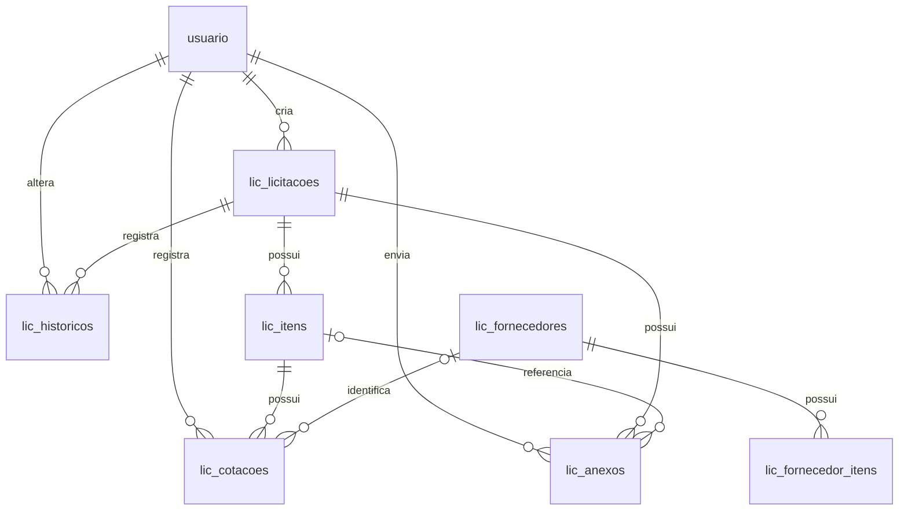

# Modelo de dados

## Tabelas

| Tabela | Entidade | Finalidade |
|---|---|---|
| `lic_licitacoes` | `Licitacao` | Cabeçalho, etapa, arquivamento e auditoria |
| `lic_itens` | `LicitacaoItem` | Itens, decisão, estratégia e resultado |
| `lic_cotacoes` | `CotacaoLicitacao` | Cotações por item |
| `lic_historicos` | `LicitacaoHistorico` | Transições e snapshot JSON |
| `lic_anexos` | `LicitacaoAnexo` | Nome de exibição e metadados de arquivos |
| `lic_fornecedores` | `FornecedorLicitacao` | Fornecedores/fabricantes, com CNPJ opcional e único |
| `lic_fornecedor_itens` | `FornecedorItem` | Itens ofertados pelo fornecedor |
| `lic_portfolio_estoque` | `PortfolioEstoque` | Estoque do portfólio |

Todos os valores monetários usam `DECIMAL`; datas de auditoria usam `DATETIME(6)`. Em `lic_itens`, `selecionado_cotacao` registra se o item participa do fluxo a partir da Cotação, sem apagar os itens não escolhidos. `legado_id` é único e reservado à idempotência da futura importação do SQLite. As auditorias apontam para `usuario`, sem criar outro cadastro.

Índices cobrem etapa/arquivada, data da disputa, chaves de licitação/item/fornecedor, histórico por data e nomes de portfólio/fornecedor. As migrations são `V2026091501__criar_modulo_licitacoes.sql`, `V2026091601__selecionar_itens_cotacao.sql`, `V2026092001__adicionar_nome_exibicao_anexos.sql` e `V2026092002__adicionar_cnpj_fornecedores.sql`.
