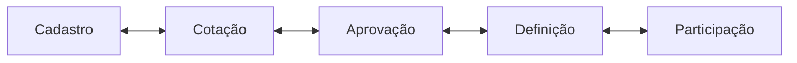

# Fluxo de etapas

`EtapaLicitacao` centraliza ordem, rótulo, etapa anterior e próxima. `LicitacaoService.transicionar` só aceita diferença de uma posição e registra origem, destino, usuário, data, observação e snapshot antes de alterar o estado.

Regras especiais:

- Aprovação só avança para Definição se não houver item `PENDENTE`;
- o botão correto é “Enviar para Definição”;
- consulta de outra aba nunca altera a etapa;
- retorno também cria histórico;
- “Em andamento” não é etapa: se a disputa já começou, o card é exibido nessa coluna sem mudar o banco;
- o drag-and-drop chama a mesma validação transacional do backend.
